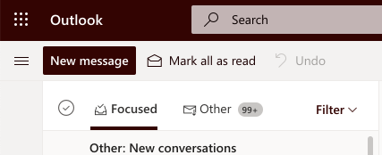
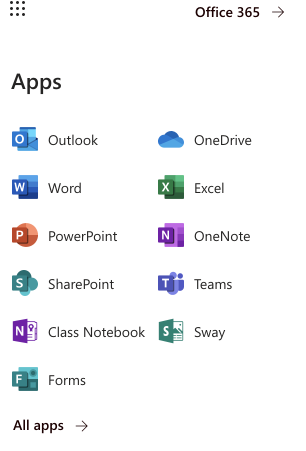
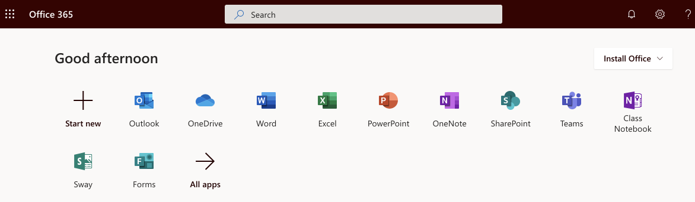
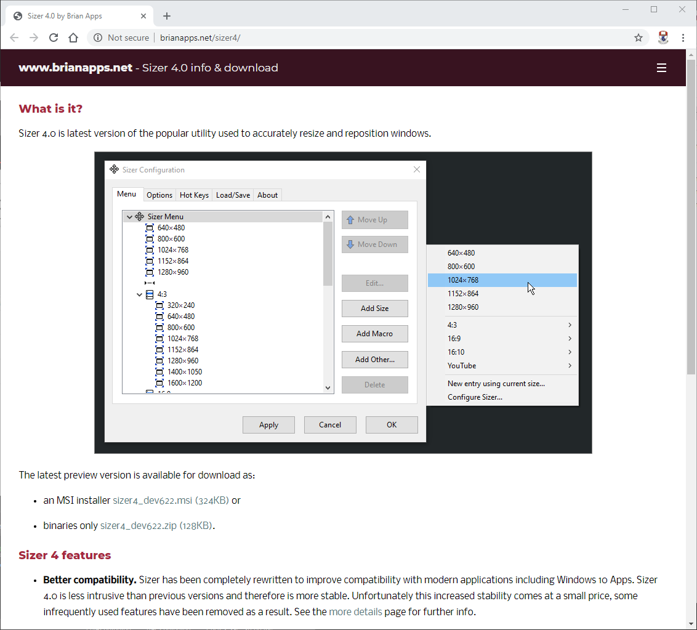
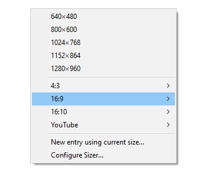

# Applications 1: PowerPoint & Sizer 4

## PowerPoint

The online version of Office 356 fine, but the Desktop version is easier to work work with for our purposes.

If you do not have this installed, then visit your WIT email:

Select the grid icon on the top left - 

and then select 'Office 365' on the top right:

An install office link appears on the top right.

## Sizer 4

Visit this site and download and install the (free) application:

- [Sizer 4](http://www.brianapps.net/sizer4/)

During install you might have to wave security restrictions:

Once installed then pressing 'Ctrl Window Z' on any application will bring up a popup window:

