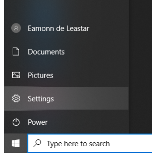
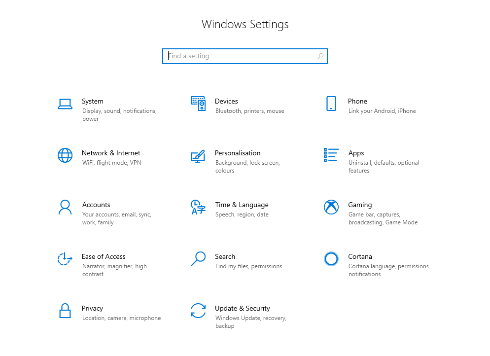
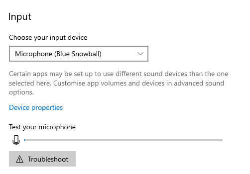
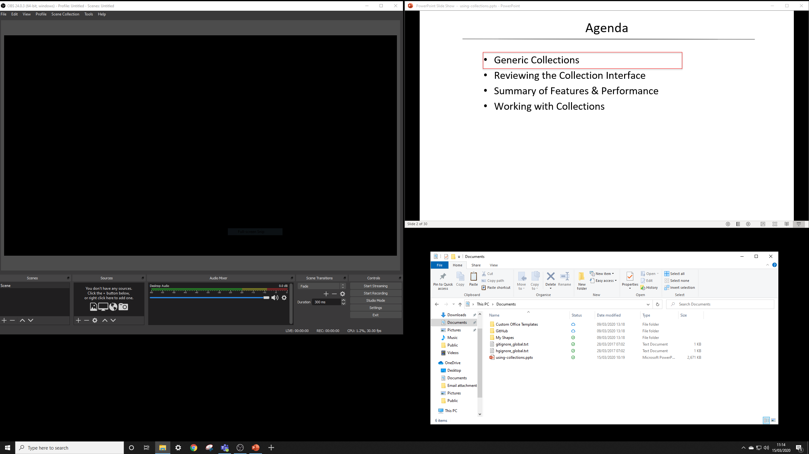

# Microphone Check

Before recording with OBS, check that your microphone is working as expected.

Locate your Windows settings:

Then locate System:

and under Sound - select your Microphone:

If you speak, then you should see the level indicator flicker. You may have a built-in Mic 
selected above. If the level indicator does not move, try the Troubleshoot button.

