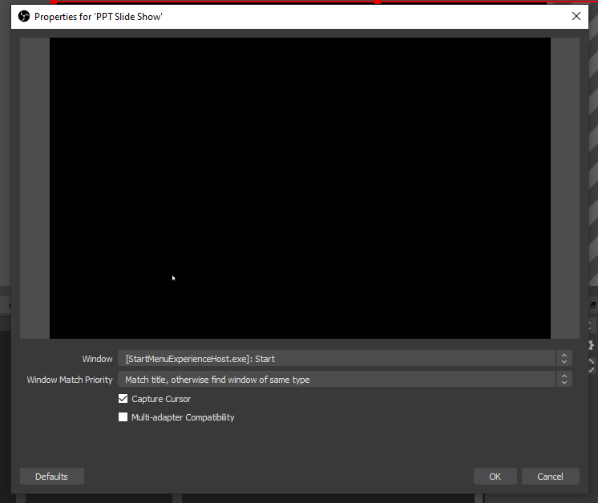
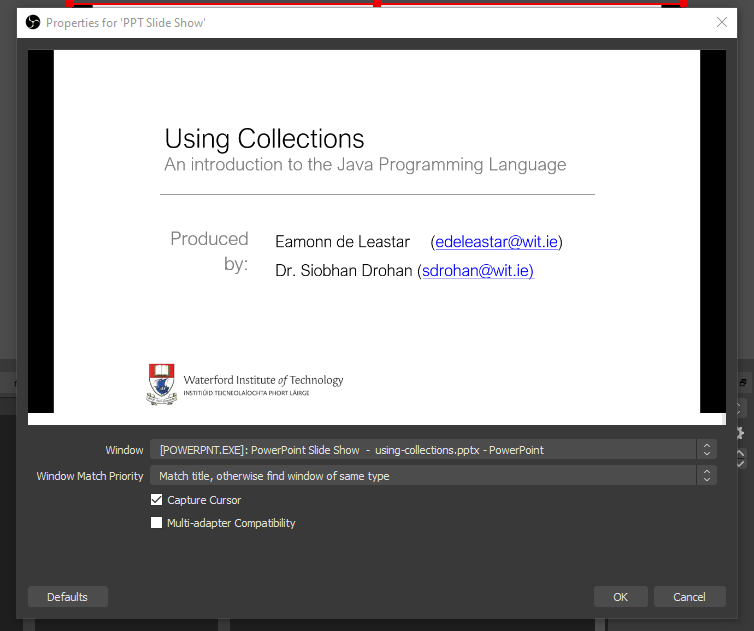
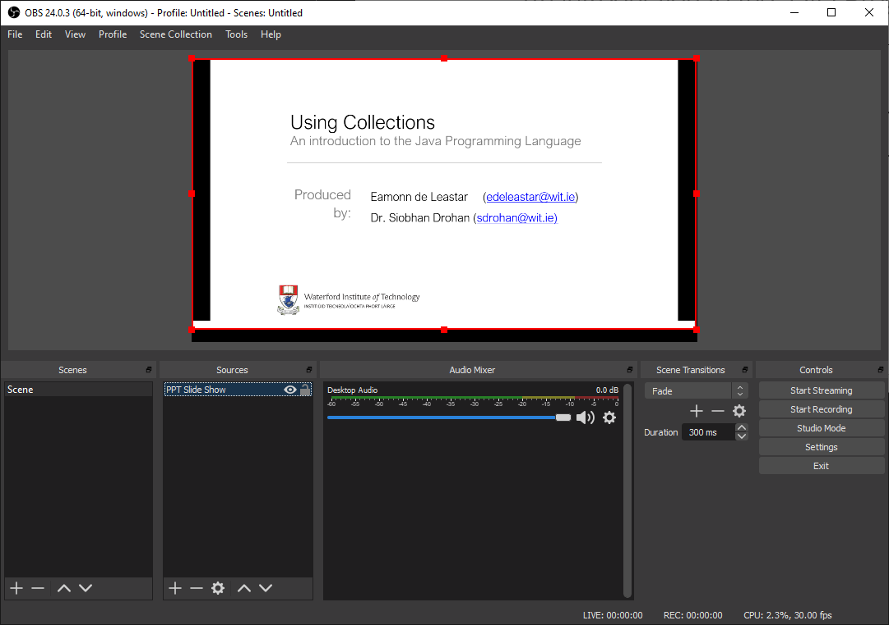
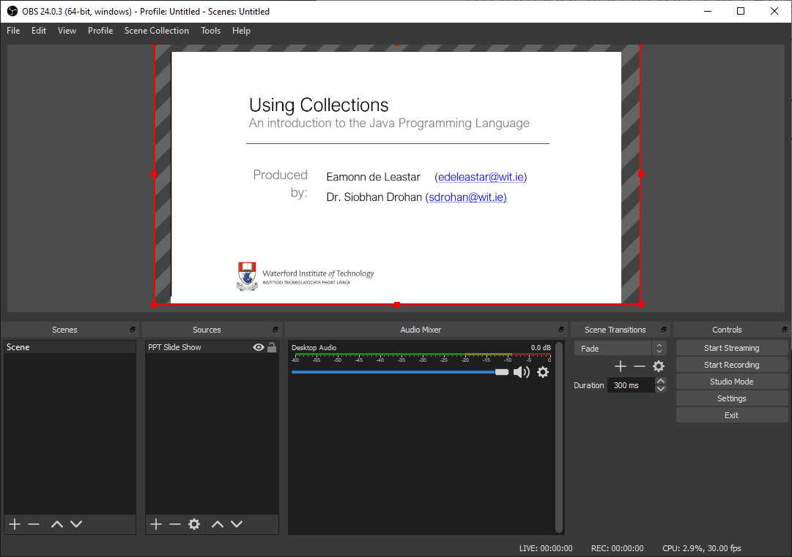

# Configuring OBS

We can arrange our desktop something like this:

Notice we have OBS on the left, the slideshow on the right. Depending on your resolution they may be overlapping (as above). This overlapping is fine and will not effect our recording.

Focussing on OBS now for :

Locate the Sources panel:

Select '+' and then 'Window Capture':

Create a new Source and call it 'PPT Slide Show

This will then display the following dialog:

Select the Window item - and it will drop drop down to reveal a list of windows:

Locate the POWERPOINT window in this list and the display will look something like this:

Press OK

Using the red guides, we can resize the surface to fit precisely in the display panel:

Even though OBS overlaps with the PowerPoint Presentation, we can still proceed with the recording. We will look at that in the next step.