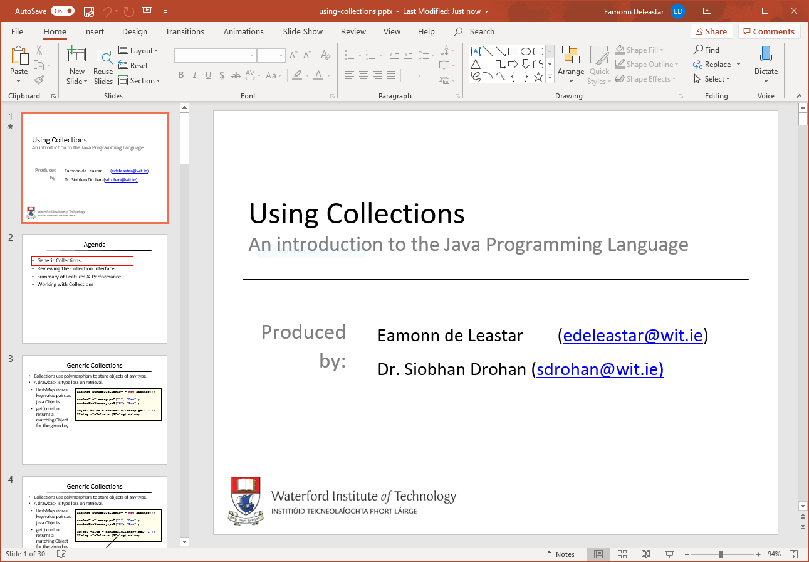
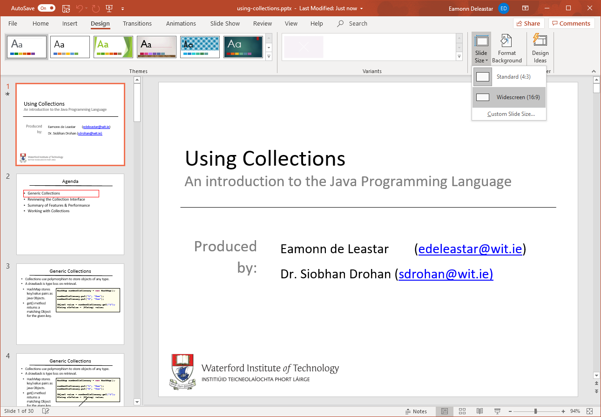
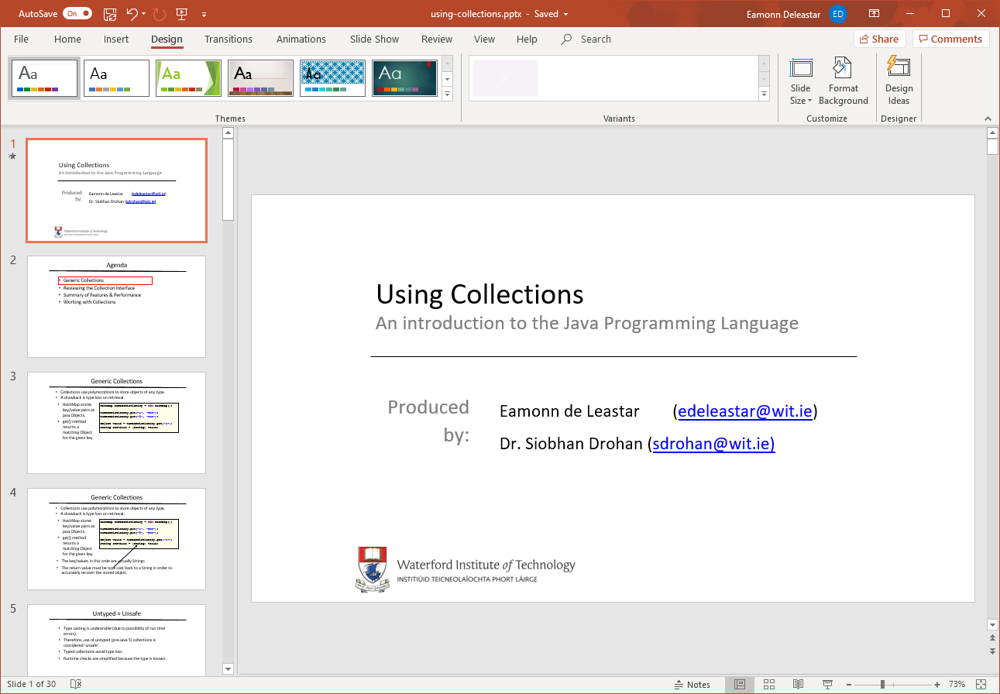
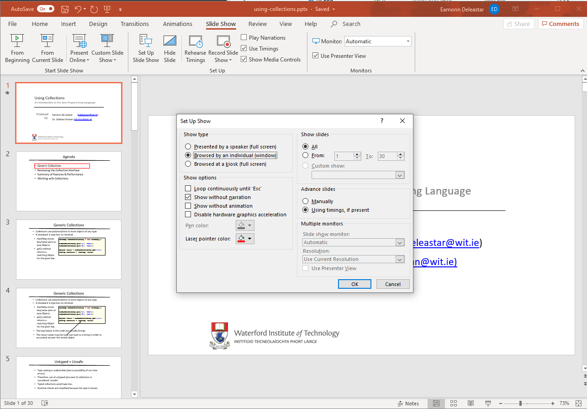
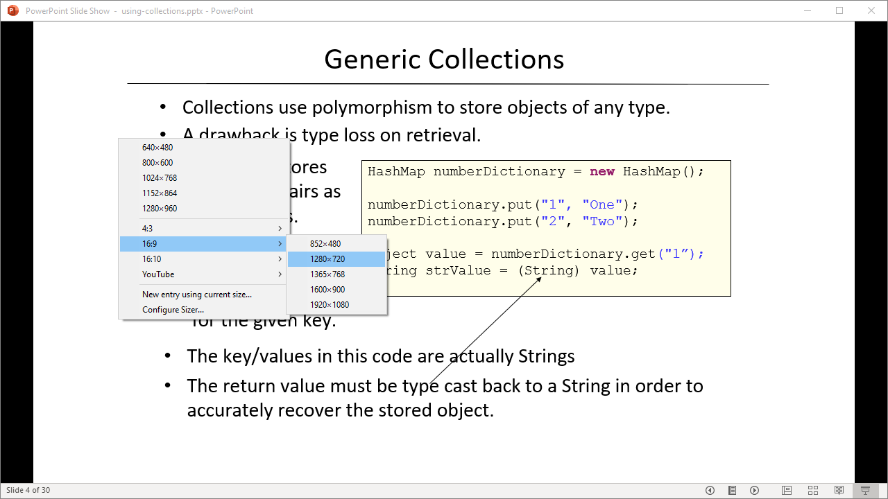

# Preparing PowerPoint

## Slide Size:

When presenting PowerPoint on video, the default dimensions of the slides are better set at 16:9 (widescreen orientation), rather than the default 4:3. This must be configure for each slide set.

So from the Home menu panel:

Select Design:

... and then switch to widescreen:

This is reset the width. You might like to take advantage of the additional space that now becomes available.

## Slide Show Presentation

From the Slide Show menus, select Set Up Slide Show:

In the above we have selected:

- Browse by an individual Window

If we play a slide show now then it will appear inside a resizable window:

This will include any animations or transitions included in your presentation as you play it. The window can be resized and positioned anywhere on screen.

## Presentation Window Size

If the - [Sizer 4](http://www.brianapps.net/sizer4/) application is running, you can select Ctrl-Window-Z on the Presentation (in slide show mode):

Resize the window as shown above to 1280x720.

All set no to try a recording!