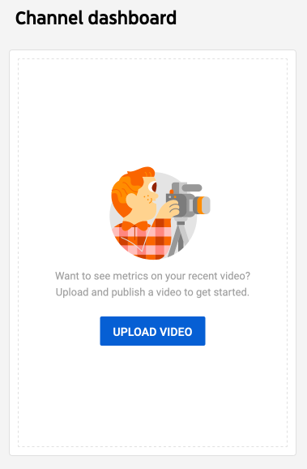
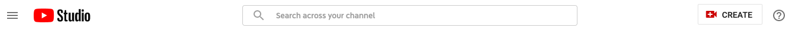
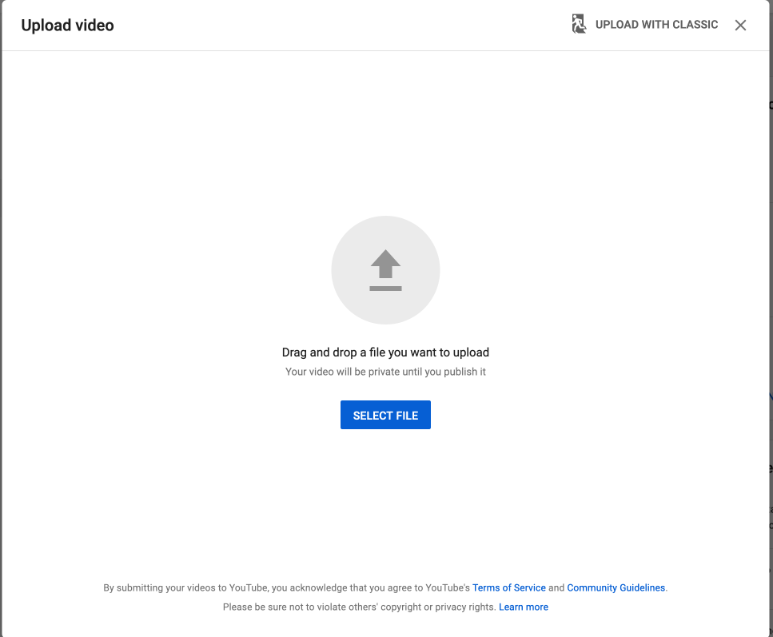
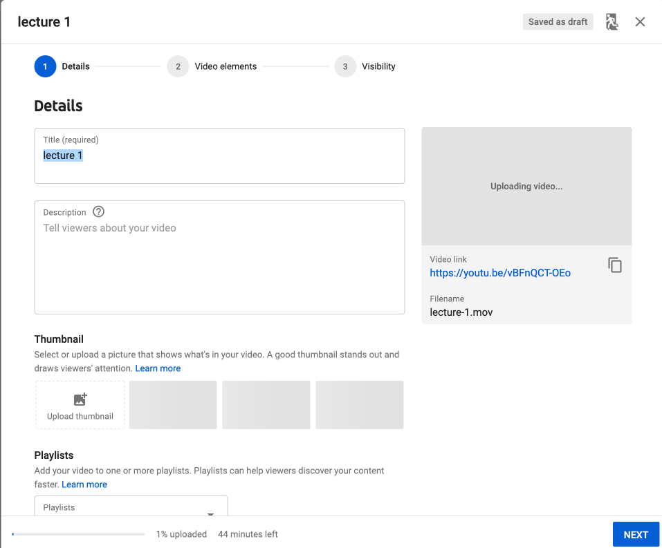
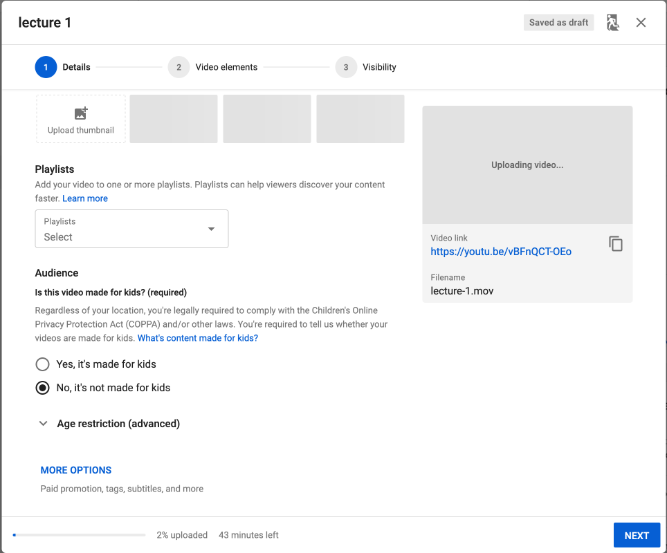
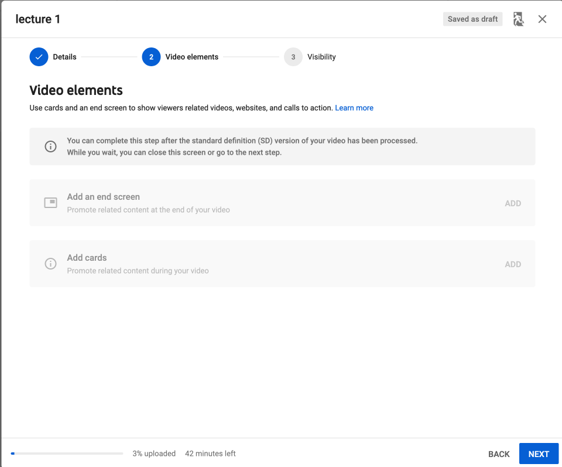
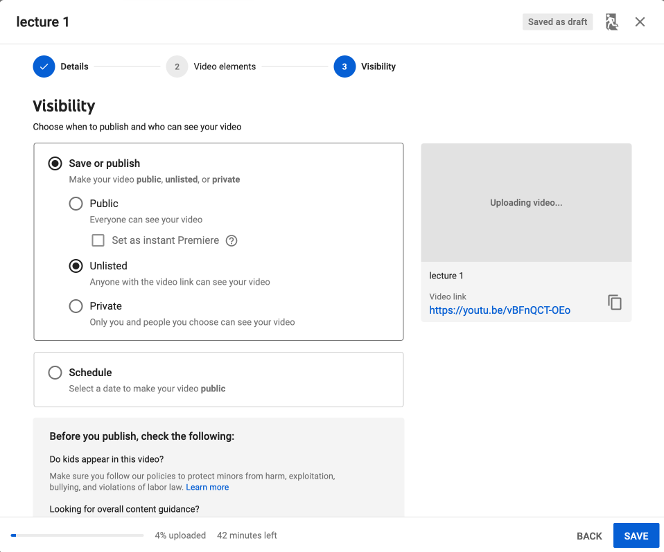
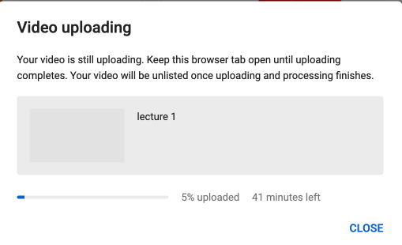
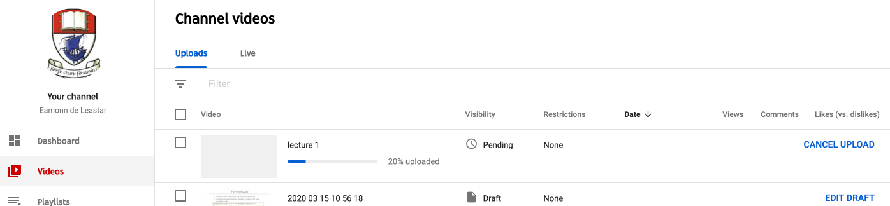

# YouTube

Log in to a gmail account, and then visit:

- <https://studio.youtube.com/>

On your dashboard you should have a panel like this:

Alternatively you have a Create button in the toolbar:

Then proceed to drag & drop or select your video file:

You can give it a title - and also a cover image if you like (not necessary)

You will need to scroll down to indicate the video is not for children:

Press Next - and accept all defaults

On the next screen select unlisted - and you can also copy the video URL at this stage:

The video will upload now, and the link you have copied can be shared.

Depending on the length of the video, it will take up to 20 or 30 minutes before the video becomes available. You can view its status on your dashboard. The video link as also available from here.

