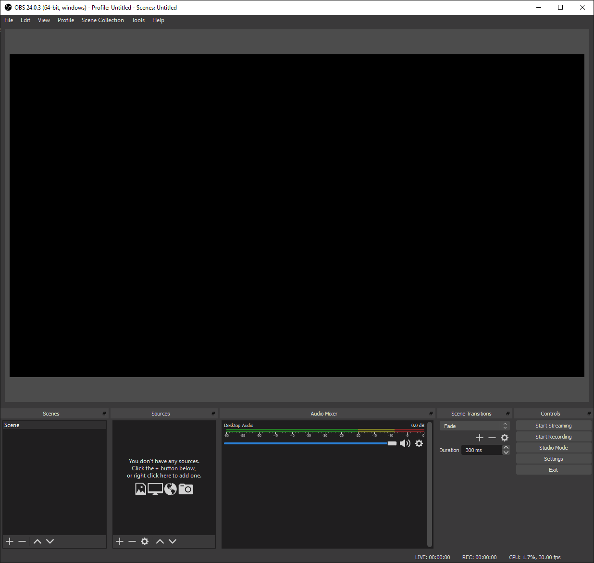
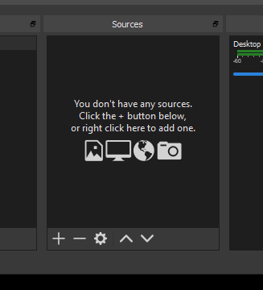
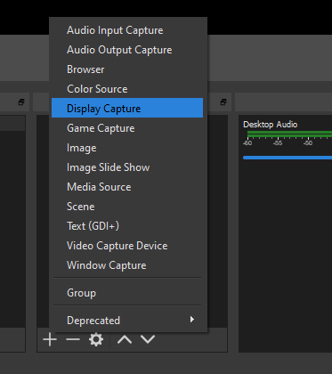
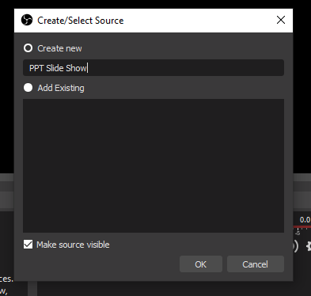

# Configuring OBS

We can arrange our desktop something like this:

Notice we have OBS on the left, the slideshow on the right.

Focussing on OBS now for :

Locate the Sources panel:

Select '+' and then 'Devices Capture':

Create a new Source and call it 'PPT Slide Show

