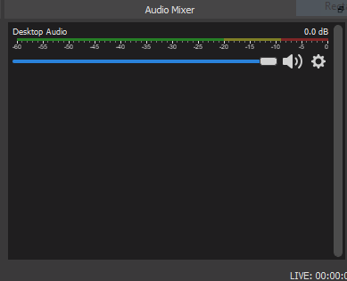
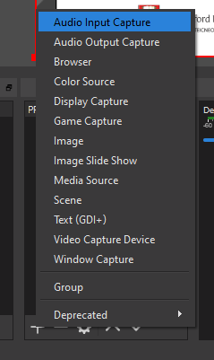
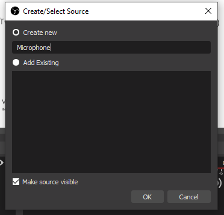
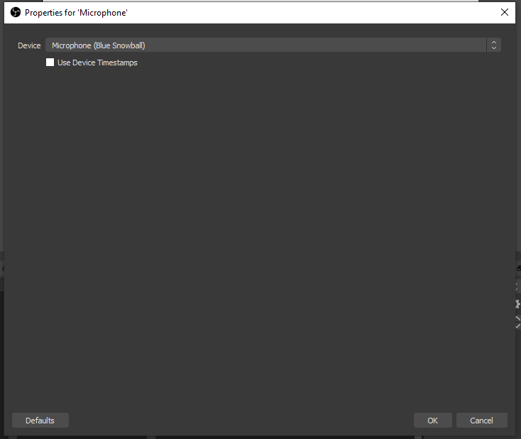
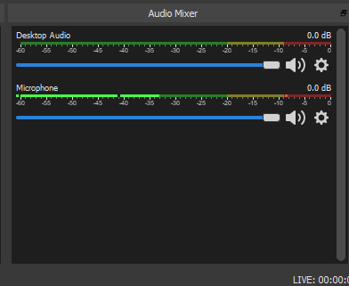
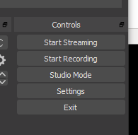

# Recording

Check to see if your mic is live be speaking - and see if the Audio Mixers flickers.

If not, you may need to go back the Sources panel and add an Audio Input Capture device:

Give the source a name:

In the next dialog, you should be able to locate and select your microphone:

The Mic should be live now:

Under the Control panel:

We have a 'Start Recording' button. Press this now to start your classs. 

You can bring the PowerPoint window to the foreground and proceed to talk through your slides.
